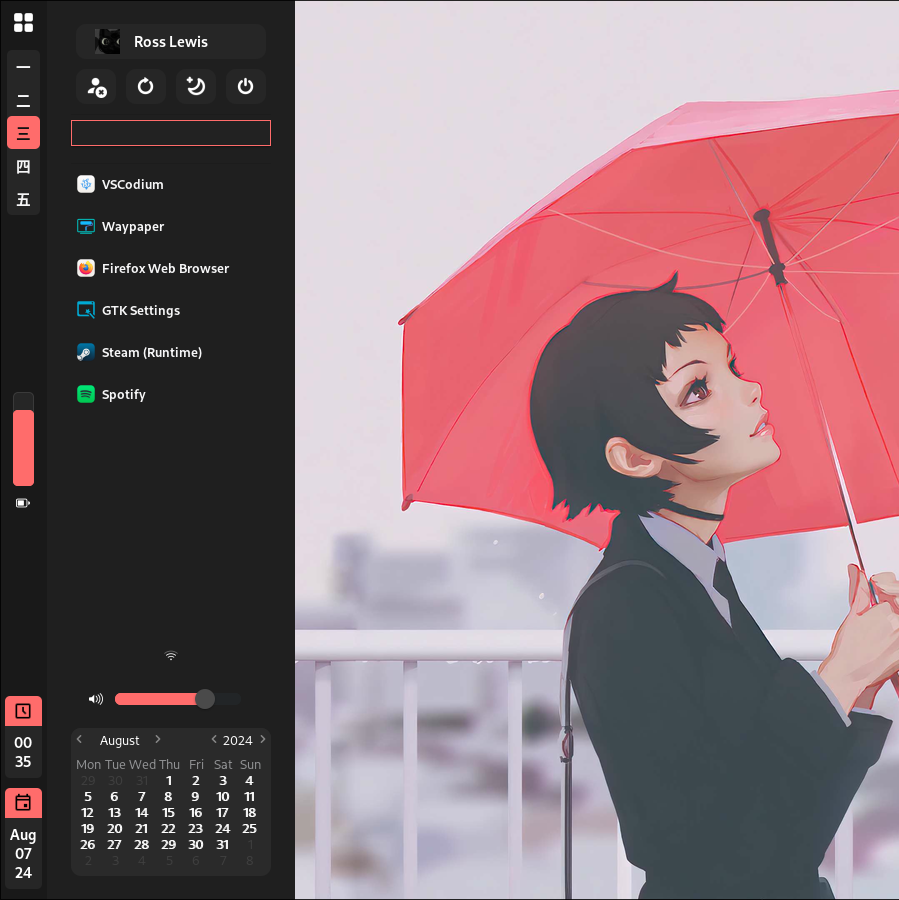
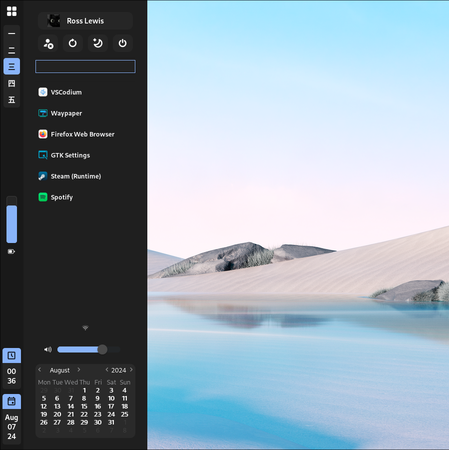
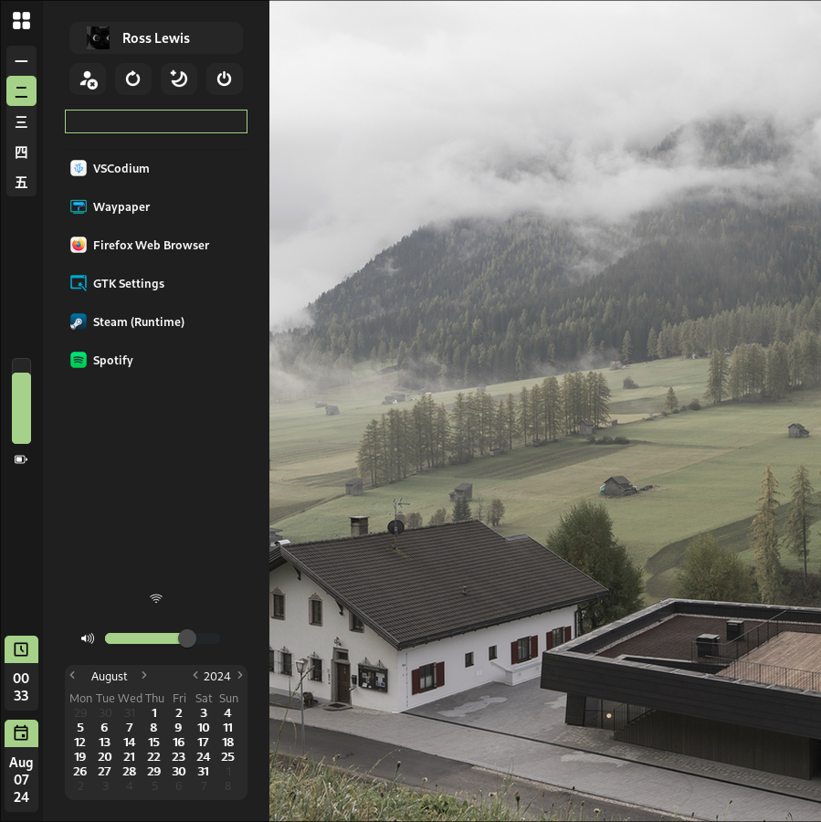
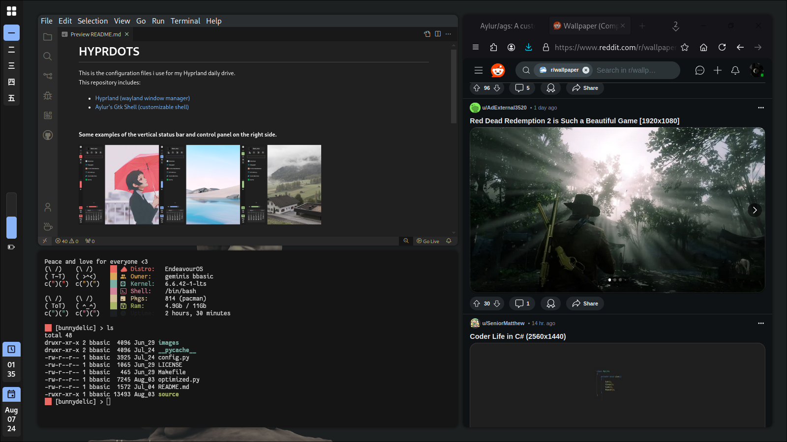

# HYPRDOTS

This is the configuration files i use for my Hyprland daily drive. 
This repository includes: 
- [Hyprland (wayland window manager)](https://hyprland.org/).
- [Aylur's Gtk Shell (customizable shell)](https://aylur.github.io/ags-docs/).
- My bashrc that includes shortcuts and my prompt.
- Kitty terminal configuration file.
- Other stuff.
 

#### Some examples of the vertical status bar and control panel on the right side.

  
    
    

#### My Workflow:

## Author notes
If you are going to use this dotfiles, inside the verticalBar directory exists a file named `"variables.js"`, there is where i store dictionaries of icons and commands to be used through some files that requires them. You might want to rename the configuration directory `("/home/your_name/.config" as example)` to match your actual config directory, where you must move the "ags" folder. 
Not changing this values might result in some icons/images not displaying up correctly, it is not a critical error or something... just wont display as it should. It is up to you.
  
I also added an executable file named "launch.sh", that it is used to launch and re-launch ags. 
You can bind to your like. In my case i use `SUPER + R` to do such task. 

## Resources (other stuff i use)
- [DMZ Cursor (Left Handed)](https://www.pling.com/p/999651/)

- [WinSur Icon Theme](https://www.gnome-look.org/p/1405756/) 

- [ArchLabs GTK3 Theme](https://github.com/ArchLabs/archlabs/blob/master/x86_64/archlabs-themes-1.5.9-1-x86_64.pkg.tar.xz) 
